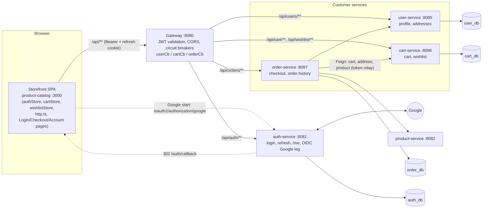

# 16. Customer Accounts Component Diagram

```mermaid
flowchart LR
    subgraph Browser
        SPA["Storefront SPA<br/>product-catalog :3000<br/>(authStore, cartStore, wishlistStore,<br/>http.ts, Login/Checkout/Account pages)"]
    end

    GW["Gateway :8080<br/>JWT validation, CORS, circuit breakers<br/>userCb / cartCb / orderCb"]
    AU["auth-service :8081<br/>login, refresh, /me, OIDC Google leg"]
    G(("Google"))

    subgraph Customer services
        US["user-service :8085<br/>profile, addresses"]
        CS["cart-service :8086<br/>cart, wishlist"]
        OS["order-service :8087<br/>checkout, order history"]
    end

    PS["product-service :8082"]

    UDB[("user_db")]
    CDB[("cart_db")]
    ODB[("order_db")]
    ADB[("auth_db")]

    SPA -- "/api/** (Bearer + refresh cookie)" --> GW
    SPA -. "Google start: /oauth2/authorization/google" .-> AU
    AU <--> G
    AU -. "302 /auth/callback" .-> SPA
    GW -- "/api/auth/**" --> AU
    GW -- "/api/users/**" --> US
    GW -- "/api/cart/**, /api/wishlist/**" --> CS
    GW -- "/api/orders/**" --> OS
    OS -- "Feign: cart, address, product (token relay)" --> CS
    OS --> US
    OS --> PS
    US --> UDB
    CS --> CDB
    OS --> ODB
    AU --> ADB
```
